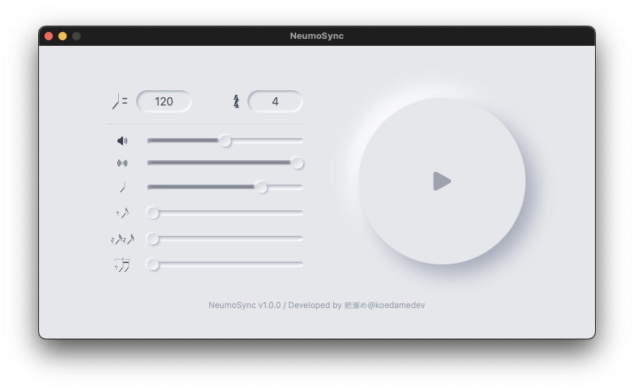

# NeumoSync


**NeumoSync - スタイリッシュで正確なメトロノームアプリ**



NeumoSyncは、美しいNeumorphismデザインを採用した最新のメトロノームアプリです。シンプルで直感的なインターフェースで、初心者からプロのミュージシャンまで、誰でも簡単に使えます。

以下の特徴を備えています：

- **正確なタイミング**：高精度なリズム同期で、練習や演奏のパフォーマンスを向上させます。
- **カスタマイズ可能なテンポ**：BPM（ビート毎分）を自由に設定でき、様々な音楽ジャンルに対応します。
- **視覚的なデザイン**：Neumorphismスタイルの美しいUIで、見た目も楽しく使えます。
- **多機能**：複数の拍子設定や音色変更機能を搭載し、練習の幅を広げます。

NeumoSyncで、あなたの音楽体験を次のレベルへ引き上げましょう。

## 特徴

- 正確なテンポ設定
- カスタマイズ可能な拍子
- 美しいNeumorphismデザイン
- 使いやすいインターフェース

## 開発環境のセットアップ

### 事前準備

事前に以下のツールをインストールする必要があります：

- [Bun](https://bun.sh/)
- [Rust](https://www.rust-lang.org/)

### インストール手順

1. リポジトリをクローン

2. 依存関係をインストール

```bash
$ bun install
```

3. アプリを起動

```bash
$ bun run tauri dev
```
