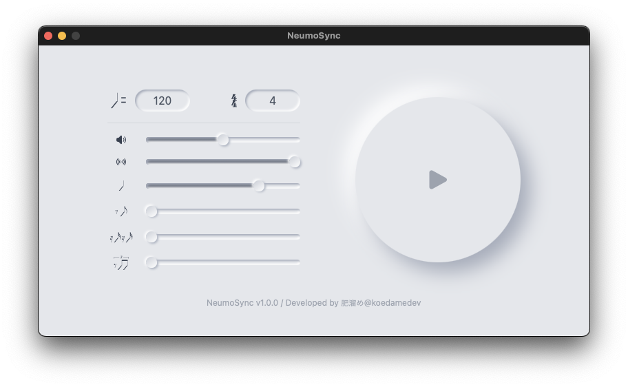

# NeumoSync


**Stylish and Accurate Metronome App**



NeumoSync is a cutting-edge metronome app featuring beautiful Neumorphism design. With a simple and intuitive interface, it is easy to use for everyone from beginners to professional musicians.

Key features include:

- **Accurate Timing**: High-precision rhythm synchronization enhances your practice and performance.
- **Customizable Tempo**: Set the BPM (beats per minute) freely to suit various music genres.
- **Visual Design**: Enjoy using the app with its visually appealing Neumorphism-style UI.
- **Versatile Functions**: Set the number of beats per measure, and adjust the volume of the accent, quarter, eighth, triplet and sixteenth notes separately. The pitch changes with the type of beat.

Take your musical experience to the next level with NeumoSync.

## Features

- Accurate tempo setting
- Customizable time signatures
- Beautiful Neumorphism design
- User-friendly interface

## Development Setup

### Prerequisites

You need to install the following tools beforehand:

- [Bun](https://bun.sh/)
- [Rust](https://www.rust-lang.org/)

### Installation

1. Clone the repository

2. Install dependencies

```bash
$ bun install
```

3. Run the app

```bash
$ bun run tauri dev
```

## License

[MIT](./LICENSE)
