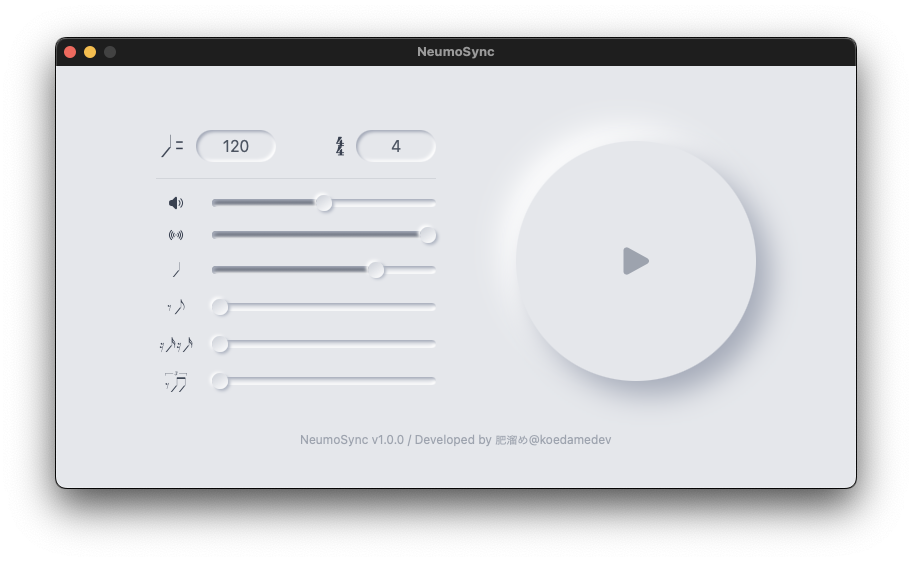

# NeumoSync

**Stylish and Accurate Metronome App**

NeumoSync is a cutting-edge metronome app featuring beautiful Neumorphism design. With a simple and intuitive interface, it is easy to use for everyone from beginners to professional musicians.

Key features include:

- **Accurate Timing**: High-precision rhythm synchronization enhances your practice and performance.
- **Customizable Tempo**: Set the BPM (beats per minute) freely to suit various music genres.
- **Visual Design**: Enjoy using the app with its visually appealing Neumorphism-style UI.
- **Versatile Functions**: Equipped with multiple time signature settings and sound options to expand your practice scope.

Take your musical experience to the next level with NeumoSync.

## Features

- Accurate tempo setting
- Customizable time signatures
- Beautiful Neumorphism design
- User-friendly interface
